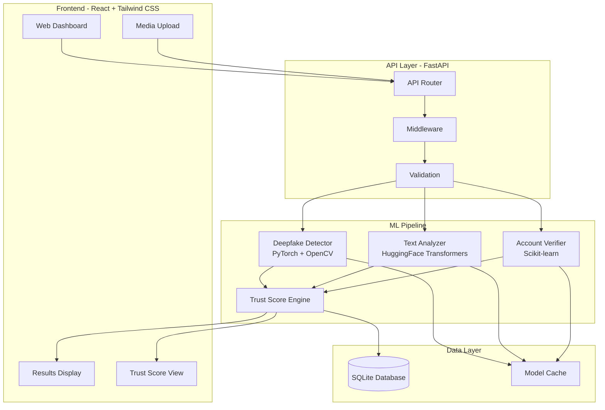

# VeriFace – Integrated AI-Fraud & Deepfake Detection Platform


## Overview

VeriFace is an advanced, AI-powered digital forensics platform designed to combat the rising tide of digital deception. As deepfakes, AI-generated text, and fabricated identities become increasingly sophisticated, verifying the authenticity of digital content is a critical challenge. 

Our platform offers a comprehensive suite of tools for detecting manipulated media (images and video), identifying AI-generated text, and flagging fake social media accounts. By analyzing multiple dimensions of a digital footprint, VeriFace computes a unified **Media & Identity Trust Score**, providing users with a clear and actionable metric for content reliability.

Built with a privacy-first approach, VeriFace allows for local processing and containerized deployment, ensuring that sensitive data remains secure while leveraging cutting-edge machine learning models.

## Features

- 🎭 **Deepfake Detection**: Advanced computer vision models to identify manipulated images and videos.
- 📝 **AI Text Detection**: NLP capabilities to distinguish between human-written and AI-generated text.
- 👤 **Fake Account Detection**: Machine learning algorithms that analyze behavioral and metadata patterns to flag suspicious profiles.
- 📊 **Real-time Trust Score Dashboard**: A unified interface displaying the computed Media & Identity Trust Score.
- 🔒 **Privacy-first local processing**: Ensure your data stays under your control.
- 🐳 **Docker containerized deployment**: Easy and consistent setup across any environment.

## Architecture



## Tech Stack

| Domain | Technology |
|---|---|
| **Frontend** | React, Tailwind CSS |
| **Backend API** | FastAPI, Python |
| **Machine Learning** | PyTorch, HuggingFace Transformers, Scikit-learn, OpenCV |
| **Database** | SQLite |
| **Infrastructure** | Docker, GitHub Actions |

## Quick Start

### Docker Deployment (Recommended)

1. Clone the repository:
   ```bash
   git clone https://github.com/your-org/veriface.git
   cd veriface
   ```

2. Configure environment variables:
   ```bash
   cp .env.example .env
   ```

3. Build and start the containers:
   ```bash
   docker-compose up --build
   ```

### Manual Installation

**Backend Setup:**
```bash
cd backend
python -m venv venv
source venv/bin/activate  # On Windows use `venv\Scripts\activate`
pip install -r requirements.txt
uvicorn main:app --reload
```

**Frontend Setup:**
```bash
cd frontend
npm install
npm run dev
```

## Project Structure

```text
veriface/
├── backend/
│   ├── api/
│   ├── core/
│   ├── models/
│   ├── ml_pipeline/
│   ├── main.py
│   └── requirements.txt
├── frontend/
│   ├── public/
│   ├── src/
│   │   ├── components/
│   │   ├── pages/
│   │   ├── services/
│   │   └── App.jsx
│   ├── package.json
│   └── tailwind.config.js
├── docker-compose.yml
├── README.md
├── CONTRIBUTING.md
├── SECURITY.md
└── LICENSE
```

## Screenshots

*(Screenshots of the dashboard, analysis results, and trust score will be added here)*

## Roadmap

Check out our plans for the future in [docs/roadmap.md](docs/roadmap.md).

## Contributing

We welcome contributions! Please see our [CONTRIBUTING.md](CONTRIBUTING.md) for details on how to get started.

## Team

- **Fadil Rifai** - PM / AI Integration
- **Member 2** - Backend & ML
- **Joe Thomas** - Frontend / UI-UX
- **Jose Alex** - Data Forensics & Testing

## License

This project is licensed under the MIT License - see the [LICENSE](LICENSE) file for details.
