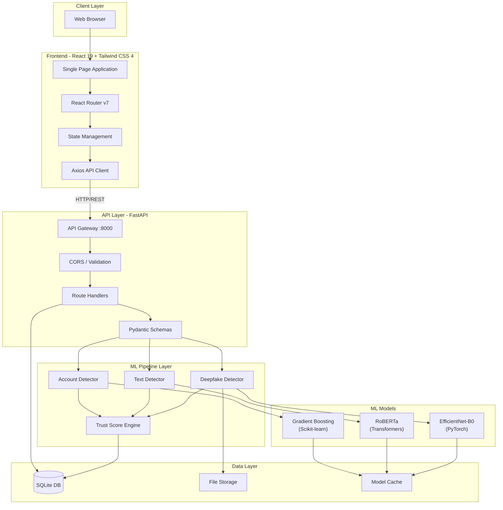
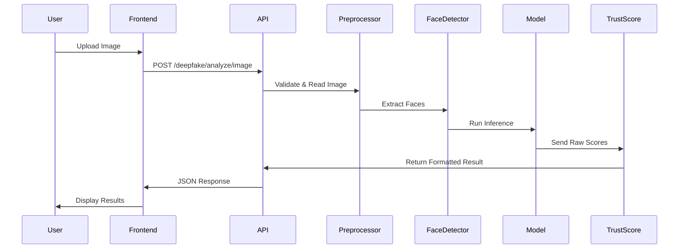
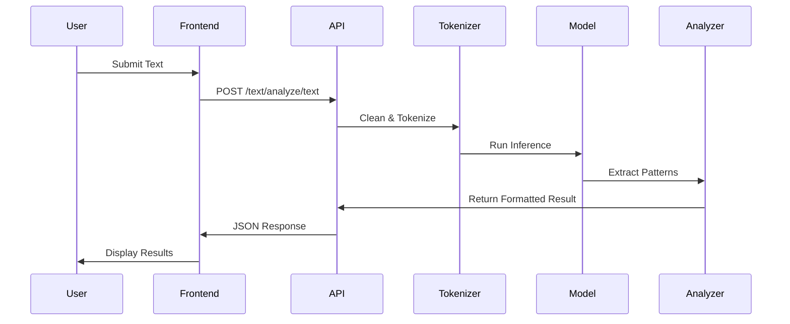
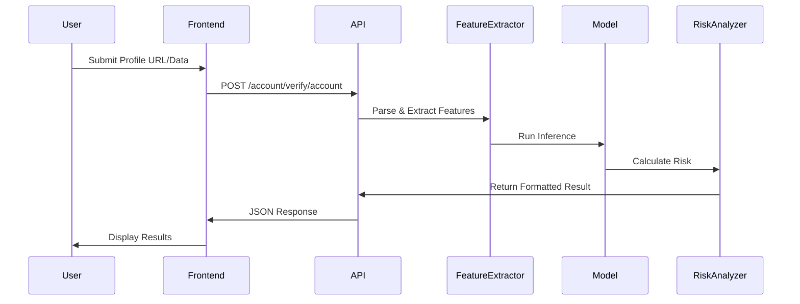
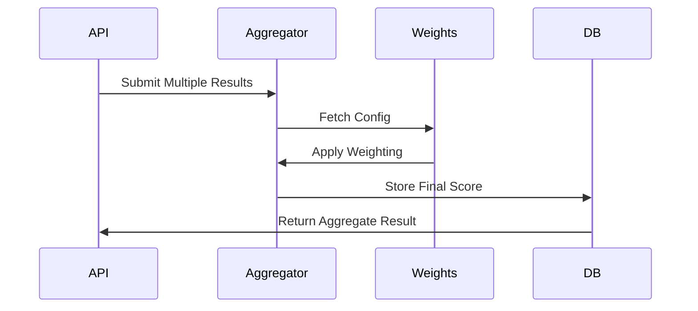
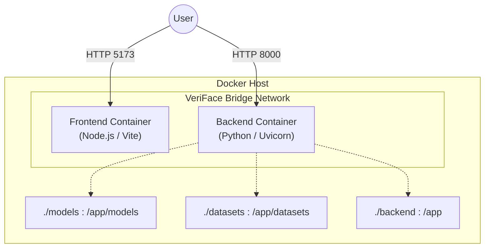
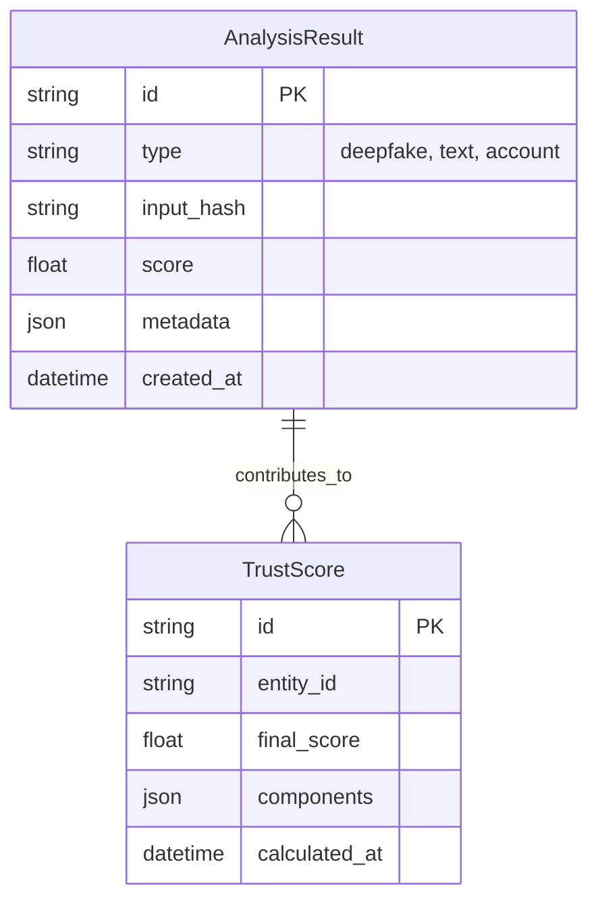

# VeriFace Architecture Documentation

## System Architecture

## Data Flow Diagrams

### 1. Image Deepfake Detection Flow

### 2. Text Analysis Flow

### 3. Account Verification Flow

### 4. Trust Score Aggregation Flow

## Deployment Architecture

## Database Schema

