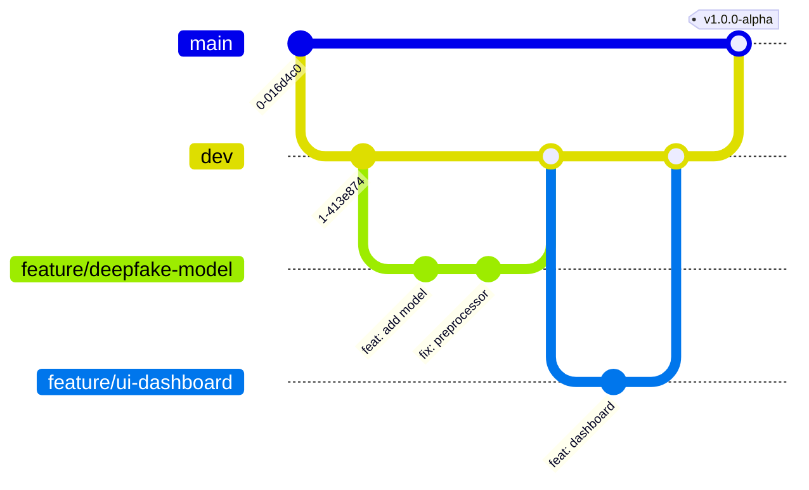

# VeriFace Branching Strategy

We follow a modified GitHub Flow approach suitable for our fast-paced 10-day sprint.

## Branch Types
- `main` - production-ready, protected. Code here is deployable.
- `dev` - integration/staging branch. Active development merges here.
- `feature/<name>` - new features.
- `bugfix/<name>` - bug fixes.
- `hotfix/<name>` - urgent production fixes (branches directly from `main`).
- `docs/<name>` - documentation updates.

## Workflow

1. **Create Branch**: Always branch from `dev` (unless it's a hotfix).
   `git checkout -b feature/awesome-thing dev`
2. **Commit**: Make changes using conventional commits.
3. **Pull Request**: Push to remote and open a PR targeting `dev`.
4. **Review**: Code review + CI checks must pass.
5. **Merge**: Squash and merge into `dev`.
6. **Release**: Periodically (or at milestones), merge `dev` to `main` via PR.

## Commit Convention

We use Conventional Commits to automate changelogs and maintain history readability:
- `feat`: A new feature
- `fix`: A bug fix
- `docs`: Documentation only changes
- `style`: Changes that do not affect the meaning of the code (white-space, formatting)
- `refactor`: A code change that neither fixes a bug nor adds a feature
- `test`: Adding missing tests or correcting existing tests
- `chore`: Changes to the build process or auxiliary tools

Example: `feat(ml): add efficientnet model for deepfake detection`

## Branch Protection Rules

### `main` branch:
- Require pull request reviews before merging.
- Require status checks to pass (CI tests, linting).
- No direct pushes.

### `dev` branch:
- Require status checks to pass.
- Recommended (but not strictly required for speed) PR reviews.

## Git Workflow Diagram

