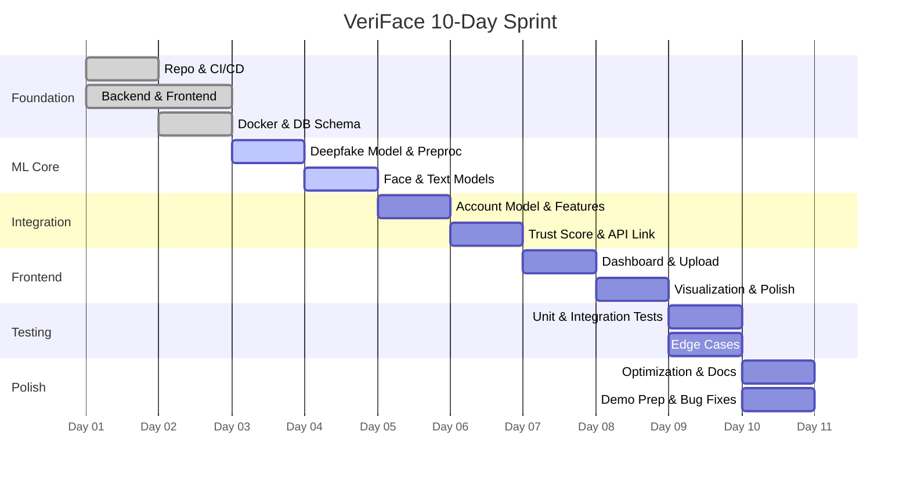

# VeriFace 10-Day Sprint Roadmap

## Milestones
* **Milestone 1: Foundation (Day 1-2)** - Setup and structural scaffolding.
* **Milestone 2: ML Core (Day 3-4)** - Basic ML models and pipelines.
* **Milestone 3: Integration (Day 5-6)** - Advanced models and engine connection.
* **Milestone 4: Frontend (Day 7-8)** - UI, visualization, and interaction.
* **Milestone 5: Testing (Day 9)** - Quality assurance and benchmarking.
* **Milestone 6: Demo & Polish (Day 10)** - Finalization and presentation prep.

## Roadmap Breakdown

### Day 1-2: Foundation Sprint
- [x] Repository setup and CI/CD
- [x] Backend API skeleton
- [x] Frontend scaffold
- [x] Docker configuration
- [x] Database schema

### Day 3-4: ML Core Sprint
- [ ] Deepfake detection model integration
- [ ] Image preprocessing pipeline
- [ ] Face detection implementation
- [ ] Text detection model integration
- [ ] Initial model testing

### Day 5-6: Integration Sprint
- [ ] Account detection model
- [ ] Feature engineering pipeline
- [ ] Trust Score engine (implement weighted scoring)
- [ ] API ↔ ML pipeline integration
- [ ] End-to-end flow testing

### Day 7-8: Frontend Sprint
- [ ] Dashboard with statistics
- [ ] File upload with drag-and-drop
- [ ] Real-time analysis results display
- [ ] Trust score visualization (charts)
- [ ] Responsive design polish

### Day 9: Testing Sprint
- [ ] Unit tests for all ML modules
- [ ] API integration tests
- [ ] Frontend component tests
- [ ] Edge case handling
- [ ] Error handling improvements

### Day 10: Demo & Polish Sprint
- [ ] Performance optimization
- [ ] Documentation finalization
- [ ] Demo preparation
- [ ] Presentation slides
- [ ] Final review and bug fixes

## Sprint Gantt Chart

